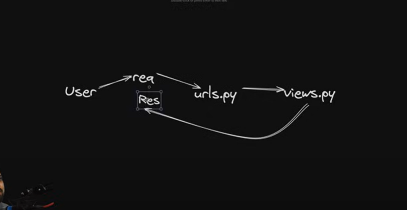
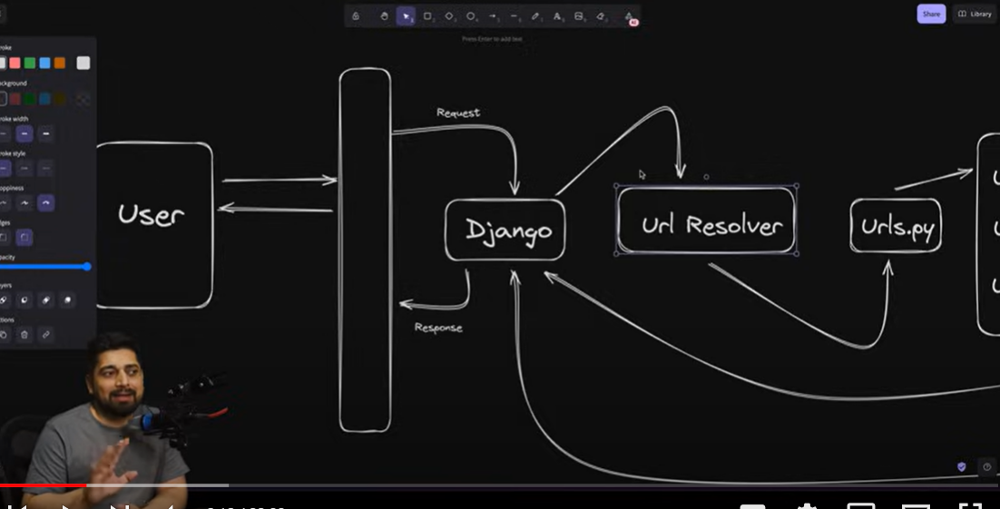
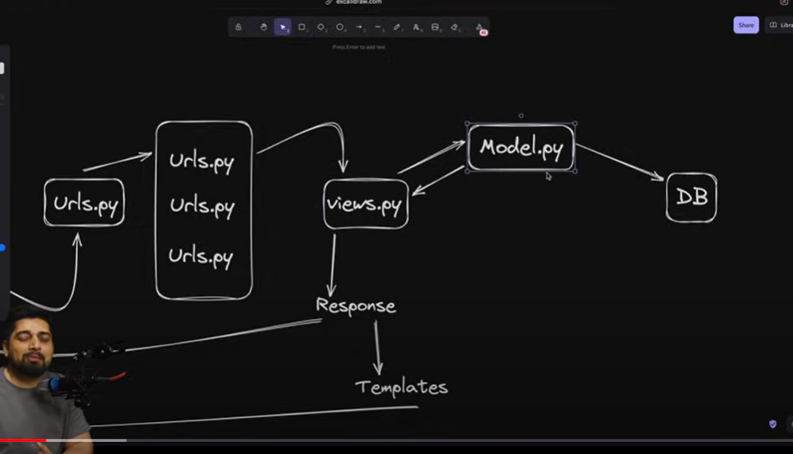
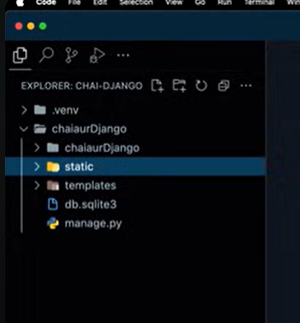

# [Templete and errors in Django ](https://docs.chaicode.com/getting-started-with-django/)
<p>check their docs link they are really good</p>

[Video link](https://youtu.be/66lfSjIrG8M?si=o8i748Wrn2dyYGzV)




## Starting with templets 
<p> This will be file structure</p>



## Creating our first views | in views.py

```
from django.http import HttpResponse

def home(request):
    return HttpResponse("<h1>Welcome to Chai's Django Project: Home page</h1>")

def about(request):
    return HttpResponse("<h1>Welcome to Chai's Django Project: About page</h1>")

def contact(request):
    return HttpResponse("<h1>Welcome to Chai's Django Project: Contact page</h1>")
```

## urls.py mai

```
from django.urls import path
from . import views

urlpatterns = [
    path('', views.home, name='home'),
    path('about/', views.about, name='about'),
    path('contact/', views.contact, name='contact'),
]
```

.............rest from docs..........